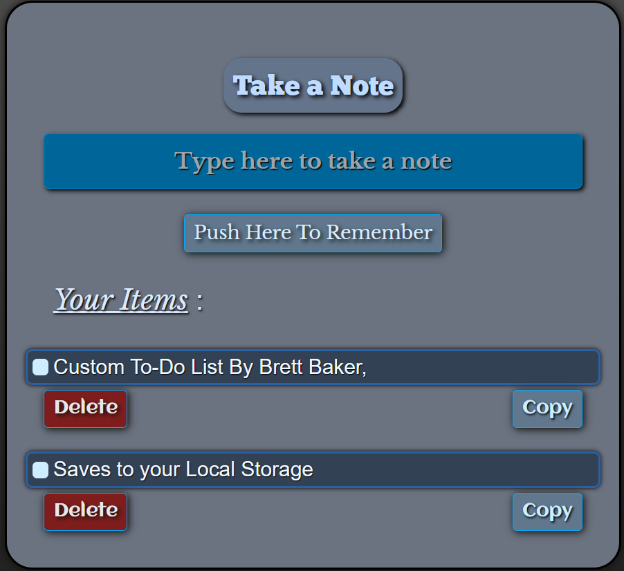

<!-- github.com/mybabb/MyBABB-Remember staging branch on build dist on render.com  -->
#  https://fishy-notepad.mybabb.com/ 
  this is the New Version
  npm run deploy is removed from the package.json file
# Todo-list

## Custom  todo-list app with a simple UI and a few features. ##

Project- I need to add some features after I test for a while.

saves to local cache per each separate browser.

# To add a page.
working on another list set the storage to match local storage. # 
set routes on WholeTodo4.jsz line 142 and change function to match. and change to Items4 in two places.
add anchor tag to NewTodoForm on NotePad4 paragraph line 45.
make route for it in App.js
style bg color on line 138 on WholeTodo4
Style each page as needed.
 # using hashrouter for now.